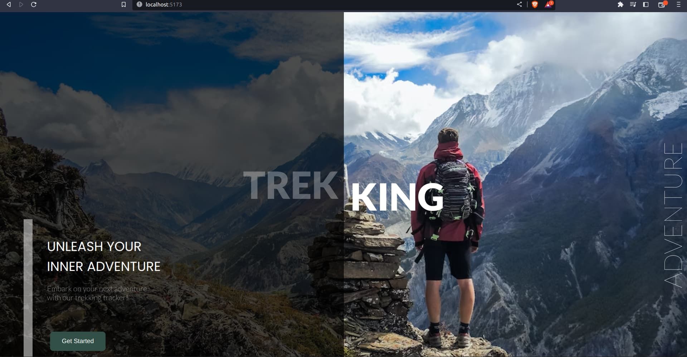
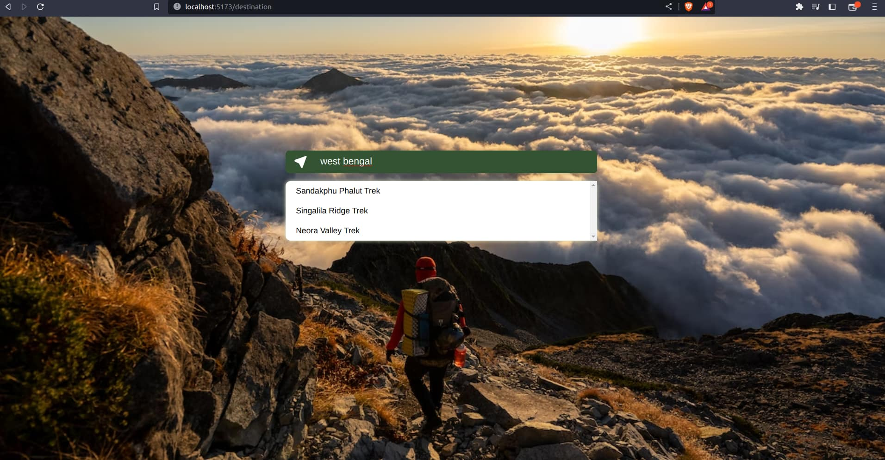
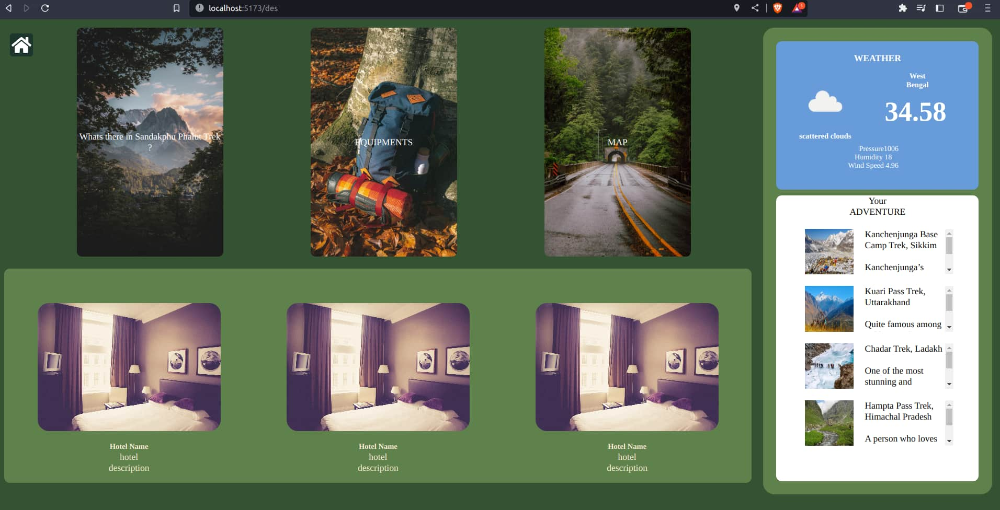

# TrekKing

This is a web-app that takes the name of any state name in India in the search bar and makes the user choose from the top 3 destinations that are present in that state and displays details like a map, description of that place, the weather(using openweather map api) of the state, hotels, and equipments required of the top three trekking destinations added to that had been added dynamically to the Mongo Atlas.

